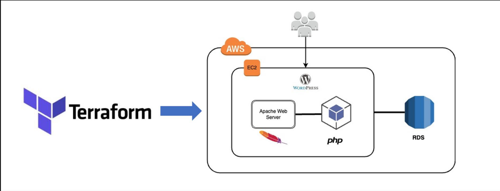

# Project README

## Overview
This project provisions AWS EC2 and RDS instances using Terraform. The infrastructure is defined in code, making it easy to manage and scale. Additionally, GitHub Actions workflows are implemented to automate the Terraform apply and destroy tasks.

## Architecture



## Prerequisites
- Terraform installed on your local machine
- AWS CLI configured with appropriate credentials
- An AWS account
- GitHub account with repository access

## Setup

1. **Clone the repository**
    ```sh
    git clone <repository-url>
    cd <repository-directory>
    ```

2. **Initialize Terraform**
    ```sh
    terraform init
    ```

3. **Review and modify variables**
    - Edit the `variables.tf` file to customize the configuration as needed.

4. **Plan the infrastructure**
    ```sh
    terraform plan
    ```

5. **Apply the configuration**
    ```sh
    terraform apply
    ```

## GitHub Actions Workflows
This project includes GitHub Actions workflows to automate the Terraform apply and destroy tasks. To use these workflows, you need to create GitHub secrets for database and AWS configuration.

### Required GitHub Secrets
- `AWS_ACCESS_KEY_ID`: Your AWS access key ID
- `AWS_SECRET_ACCESS_KEY`: Your AWS secret access key
- `DB_USERNAME`: The username for your database
- `DB_PASSWORD`: The password for your database
- `KEY_NAME` : The AWS Key you will be using

## Resources Provisioned
- **EC2 Instance**: A virtual server for running applications.
- **RDS Instance**: A managed relational database service.

## Outputs
After applying the configuration, Terraform will output the following:
- EC2 instance public IP
- RDS endpoint

## Cleanup
To destroy the infrastructure when it is no longer needed:
```sh
terraform destroy
```

## Contributing
Contributions are welcome! Please open an issue or submit a pull request.

## License
This project is licensed under the MIT License.

